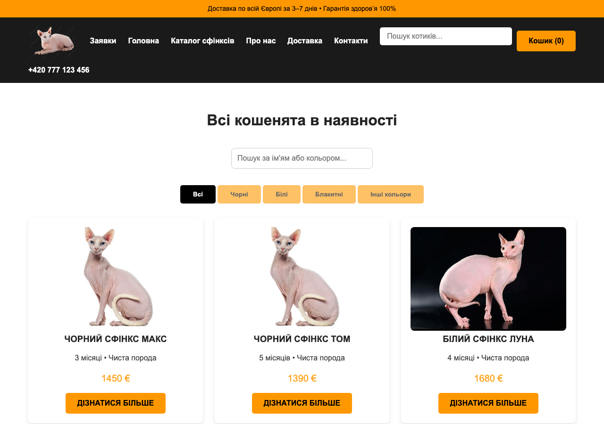
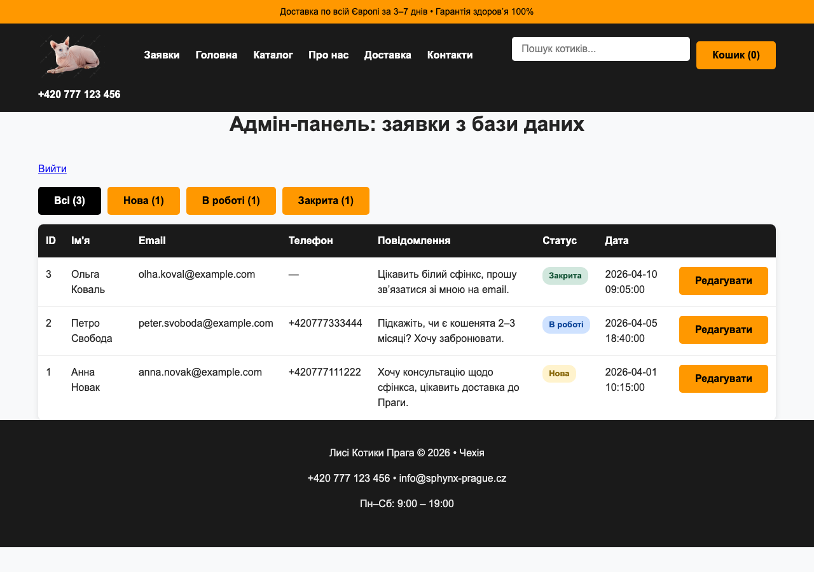

> 🌐 **Live demo (auto-updated each restart):** https://reliance-around-kelkoo-cure.trycloudflare.com  <!-- live-url -->

# Sphynx Cattery Website — PHP/MySQL Coursework Project

A small full-stack web project: a fictional Sphynx-cat cattery storefront
("Лисі Котики Прага", Prague) with static pages, a kitten catalog backed by
MySQL (with a per-kitten detail page), a public contact/booking form, and a
session-gated admin panel doing full CRUD over a MySQL table — built across
a series of front-end/back-end web development lab assignments at
Y. O. Paton Vocational College of Welding and Electronics, specialty 123
Computer Engineering.

New kitten cards are added through a companion Telegram bot,
[sphynx-cats-crm-bot](https://github.com/BreraDMR/sphynx-cats-crm-bot),
talking to `api/cats.php` over a machine-to-machine API key rather than the
admin session -- see that repo for the bot itself.

This is a learning project, not a real business or a real website anyone
can book a cat through — see [`docs/report.md`](docs/report.md) for what
each part of the course it was built for, and for the full editor's-notes
list of everything found and fixed during two review passes: broken admin
authentication, a CSRF-able delete, a reflected XSS, two disconnected data
pipelines, a broken CSS asset path, and more.

Past the bug-fixing pass, the backend was also restructured to look like
something closer to a junior/mid-level PHP project rather than coursework
PHP: SQL lives in one repository class instead of being copy-pasted across
six pages, config comes from `.env` instead of being hardcoded, every form
that changes data is CSRF-protected (not just delete), and there's a real
PHPUnit test suite for the actual PHP code (not just a Python stand-in).

## Screenshots

| Homepage catalog (live filter/search) | Admin panel (status filters + pagination) |
|---|---|
|  |  |

[Contact/booking form →](docs/screenshots/contacts.png)

## Repository layout

| Path | Contents |
|---|---|
| [`site/`](site/) | The website: public pages, the kitten catalog (`api/cats.php`, key-authenticated for the Telegram bot), the contact-form API, and the admin CRUD panel (PHP + MySQL via PDO). See `site/src/` for the repository/validator classes and `site/tests/` for the PHPUnit suite. |
| [`docs/report.md`](docs/report.md) | What the project covers, how to run it, and the full editor's-notes list of everything found and fixed. |
| [`tools/validate_request.py`](tools/validate_request.py) | A Python mirror of the PHP-side form validation rules, with unit tests — predates the real PHPUnit suite in `site/tests/`, kept since it doesn't need PHP installed to run. |

## What's verified vs. what isn't

- `site/vendor/bin/phpunit` (after `composer install` in `site/`) —
  **38/38 tests pass**, covering `RequestRepository` (CRUD, status
  filtering, pagination) and `CatRepository` (CRUD, slug generation,
  publish/draft visibility) against an in-memory SQLite database, plus
  `RequestValidator`/`RequestStatus`/`CatValidator`.
- `python3 -m unittest discover -s tests` in `tools/` — **7/7 tests pass**,
  the older Python-side mirror of the validation rules.
- The PHP/MySQL site was run end-to-end against a real local PHP built-in
  server + MySQL, twice (once after the initial bug-fix pass, again after
  the architecture rework below) -- import `database.sql`, `php -S`,
  exercise every route with `curl`. The second pass caught a real bug the
  SQLite-backed unit tests couldn't: MySQL's PDO driver rejects `LIMIT`/
  `OFFSET` bound as plain (string) parameters, which SQLite tolerates --
  see `docs/report.md` Editor's notes. Both test databases and servers
  were torn down afterwards; nothing from those runs is in this repo.

## Running it locally

```sh
cd site
composer install
cp .env.example .env          # defaults match a local MAMP/XAMPP MySQL install
# import database.sql into the database named in .env, then:
php -S localhost:8000
vendor/bin/phpunit            # 23/23, no database needed for this part
```

Default demo admin login at `/login.php`: `admin` / `sphynx-admin-2026`
(see `.env.example`).

## License

Licensed under [PolyForm Noncommercial 1.0.0](LICENSE) — free for personal,
educational, and other noncommercial use. For a commercial license,
contact Damir.
